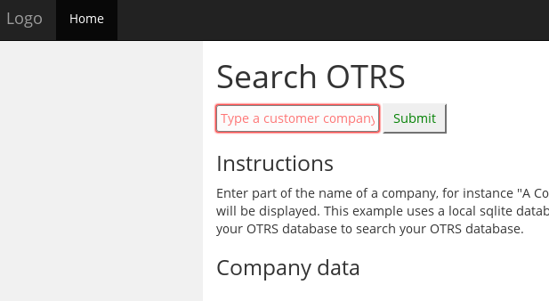
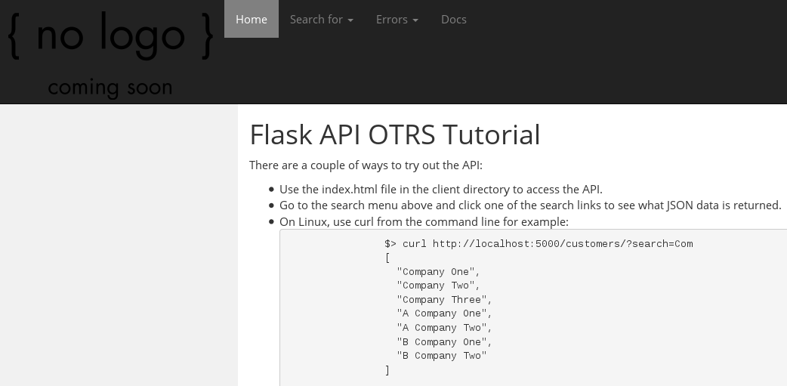

Flask REST API for OTRS Tutorial documentation
==============================================

The code is fairly well documented so do have a look at the code.
Sphinx is used in combination with the extension autodoc to complete
this documentation.

Purpose
-------
The code is meant to show you how to create a REST API with flask.
I chose to build an interface to OTRS and this project could serve as a
start to create a REST API to access OTRS. Yes, OTRS does have it's own
webservices but this is meant as a tutorial.

Since this is a Flask REST API tutorial, please view it as such and not
as a production type of code. Following improvements are possible:

* Use SQLAlchemy so you can switch to another database for production and
  maybe use SQLite just for testing
* Serve documentation with Nginx/Apache instead of via a Blueprint
* Add more tests to the code
* Measure code coverage with test coverage metrics
* Expand the API with more methods besides a few get API functions.
  A full REST API could include get, post, put and delete functionality
* Provide some means of credential checking (login)
* Change the project layout depending on the scale of your project
* Check your code for style consistency or style guides provided by your
  employer

This code is meant as a starting point to show how you could develop
a REST API in Flask/Python. The code as it is, is not meant for
production.

The client

The back-end site

Project layout
--------------
There a lot of possibilities on how to organize your code, this is just
one of them and not the focus of this tutorial.
This project uses the following layout::

    ├── api
    │   ├── static
    │   │   ├── css
    │   │   │   ├── flask_api_client.css
    │   │   │   └── flask_api_main.css
    │   │   ├── docs
    │   │   │   └── html
    │   │   │       ├── code.html
    │   │   │       └── index.html
    │   │   ├── img
    │   │   │   ├── favicon.ico
    │   │   │   └── logo.png
    │   │   └── js
    │   ├── templates
    │   │   ├── 400.html
    │   │   ├── 403.html
    │   │   ├── 404.html
    │   │   ├── 500.html
    │   │   ├── base.html
    │   │   └── index.html
    │   ├── views
    │   │   ├── customers
    │   │   │   └── index.py
    │   │   └── home
    │   │       └── index.py
    │   └── blueprints.py
    ├── client
    │   └── index.html
    ├── config
    │   └── default.py
    ├── data
    │   ├── sqlite_partial_otrs_db.sql
    │   └── temp.db
    ├── docs
    │   ├── build
    │   │   └── html
    │   │       ├── code.html
    │   │       └── index.html
    │   ├── source
    │   │   ├── code.rst
    │   │   ├── conf.py
    │   │   └── index.rst
    │   └── Makefile
    ├── instance
    │   └── config.py
    ├── logs
    │   └── flask_api_otrs.log
    ├── tests
    │   └── test_api.py
    ├── manage.py
    ├── README
    ├── LICENSE
    └── requirements.txt

Start the application
---------------------
After you have cloned the code via git, you'll need to set-up a virtualenv
using Python 3. Create a directory and set-up the virtualenv::

    $ git clone <repository url>
    $ cd flask-api-otrs-tutorial
    $ mkdir venv
    $ python3 -m "venv" venv
    $ source venv/bin/activate
    $ pip install -r requirements.txt

Create a local config.py file if you have your own local settings::

    $ touch instance/config.py

An example of what you could put in the config.py. Mind that if you
would put your PostgreSQL database info here, you will need to change
the code to connect to the PostgreSQL database instead of SQLite::

    # -*- coding: utf-8 -*-
    """Instance (local) settings. This file should not be under code
    revision if you put your local settings in it.

    """

    """Default PostgreSQL database settings. If changing the example to 
    connect to your OTRS PostgreSQL database, you could put your settings
    here."""
    #DATABASE_HOST =  ""
    #DATABASE_NAME = ""
    #DATABASE_USER = ""
    #DATABASE_PASSWORD = ""
    #DATABASE_PORT = 5432

    """Flask settings."""
    #SECRET_KEY = ""

You start the application via the manage.py script::

    $ python manage.py

Flask will run on http://localhost:5000.

You can visit this website (back-end) to learn more and see some basic calls.
There is also a client in client/index.html that will allow you to search
the customers in the SQLite database. After you've typed at least 3
characters, the input is used to filter the list of customers.
This info is sent to the  back-end via **Ajax**.

The manage.py file is meant to start the application. If you want to
add your own additional commands, this is where you would put them.
Check out Flask-Script, Flask-Runner or the Flask command line
interface (CLI), new in Flask version 0.11.

.. automodule:: manage
   :members:

App creation
------------
The Flask application object is created by a factory function.
This is done with the create_app function.

.. automodule:: api
   :members:

Blueprints
----------
You can find more info on Blueprints in the official Flask documentation.
Blueprints are a convenient way to bundle and manage the routes and
views meant to handle them.

.. automodule:: api.blueprints
   :members: _factory

API functions
-------------
Our very small API only exposes 2 API urls /customers/ and /customers/info.
These urls route to the following functions:

* get_customers is used to lookup a list of customer names in the
  database in order to facilitate the autocomplete feature of the
  search field.

* get_customer_info then retrieves the customer info based on a
  company name

.. automodule:: api.views.home.index
   :members: index

.. automodule:: api.views.customers.index
   :members: get_customers, get_customer_info

Following helper functions are used to execute the sql's.

.. automodule:: api.views.customers.index
   :members: _execute_sql, _get_customers, _get_customer_info

Tests
-----
Only a couple of example tests are provided to test basic testing.
To be more complete when you design and develop an API, you could/should
use coverage tests too. Testing the GUI is another possible suite of
tests.

.. autoclass:: tests.test_api.APITestCase
   :members: test_404, test_home, test_search_customer_wrong_method, test_search_customer, test_get_custumer_info

Documentation
-------------
Documentation is done via Sphinx and the rst format.
The documents are prebuilt for your convenience, something that might
not be done in a production setting since you can just generate the docs
your self.

To automatically document the code, the Sphinx autodoc extension is used.
The source of the document is /docs/source/code.rst.
We try to use the Google style comments as much as possible.

To build the documentation, from the command line::

    $ source venv/bin/activate
    $ make html

The output files are placed in /docs/build/html. Open the index.html
or the code.html files in a browser.

As said before, for convenience the docs are available from the menu in
the back-end application. In a production setting, you would use your
webserver to set up a location to serve the docs and not have this
served up by the Flask app.

Database
--------
For simplicity, the database used is SQLite. In a production environment
this could be PostgreSQL or another DB.
If you want change this, you should use SQLAlchemy or for instance,
in my case this would be PostgreSQL.

Use a production database
-------------------------
For instance if you would have an OTRS instance using a PostgreSQL
database, do the following.
In api/views/customers/index.py:

    * import psycopg2
    * edit execute_sql(sql)

        * uncomment this block of code::

            CON_PARAM = { 'dbname': current_app.config['DATABASE_NAME'],
            'user': current_app.config['DATABASE_USER'],
            'password': current_app.config['DATABASE_PASSWORD'],
            'host': current_app.config['DATABASE_HOST'],
            'port': current_app.config['DATABASE_PORT']

        * comment the sqlite3.connect line and uncomment the psycopg2 line::

            conn = psycopg2.connect(**CON_PARAM)
            #conn = sqlite3.connect(current_app.config['DATABASE'])

    * create a local file to put your settings in::

        $ vi instance/config.py

      These are possible settings::

            DATABASE_NAME - dbname: the database name
            DATABASE_USER - user: user name used to authenticate
            DATABASE_PASSWORD - password: password used to authenticate
            DATABASE_HOST - host: database host address
            DATABASE_PORT - port: connection port number
            SECRET_KEY= ''
            

License
-------
Distributed under the MIT license, see LICENSE file for the full text.
